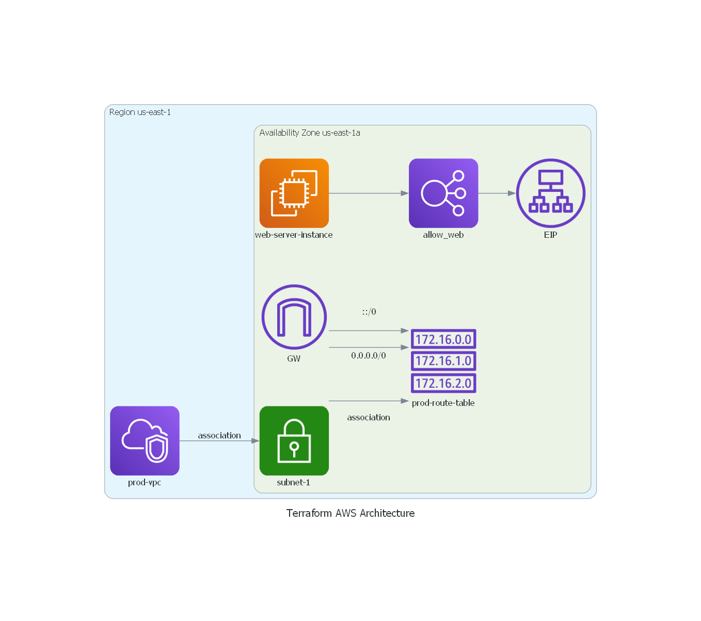

# Terraform AWS Architecture

This Terraform project provisions an AWS infrastructure with the following components:

- **VPC**: A Virtual Private Cloud (VPC) named `prod-vpc` with CIDR block `10.0.0.0/16`.
- **Internet Gateway**: An internet gateway (`gw`) attached to the VPC for internet access.
- **Route Table**: A route table (`prod-route-table`) associated with the VPC to route traffic.
- **Subnet**: A public subnet (`subnet-1`) with CIDR block `10.0.1.0/24` in availability zone `us-east-1a`, associated with the route table.
- **Security Group**: A security group (`allow_web_traffic`) allowing inbound traffic on ports 80 (HTTP), 443 (HTTPS), and 22 (SSH).
- **Network Interface**: A network interface (`web-server-nic`) attached to the subnet with a private IP `10.0.1.50` and associated with the security group.
- **Elastic IP**: An Elastic IP (EIP) associated with the network interface.
- **EC2 Instance**: An EC2 instance (`web-server-instance`) launched in the subnet, running Apache web server.



## Requirements

- [Terraform](https://www.terraform.io/downloads.html) >= v0.12.0
- AWS account with appropriate access keys

## Usage

1. Clone the repository:

   ```bash
   git clone https://github.com/SaiyedRushan/TerraformAWS.git
   cd terraform-aws-architecture
   ```

2. Initialize Terraform:

   ```bash
   terraform init
   ```

3. Create an execution plan:

   ```bash
   terraform plan
   ```

4. Apply the changes:

   ```bash
   terraform apply
   ```

5. Destroy the infrastructure (when no longer needed):

   ```bash
   terraform destroy
   ```

## Inputs

- `aws_access_key`: AWS access key (sensitive, should be kept secret).
- `aws_secret_key`: AWS secret key (sensitive, should be kept secret).

## Outputs

- `server_public_ip`: Public IP address of the EC2 instance.
- `server_private_ip`: Private IP address of the EC2 instance.
- `server_id`: Instance ID of the EC2 instance.
